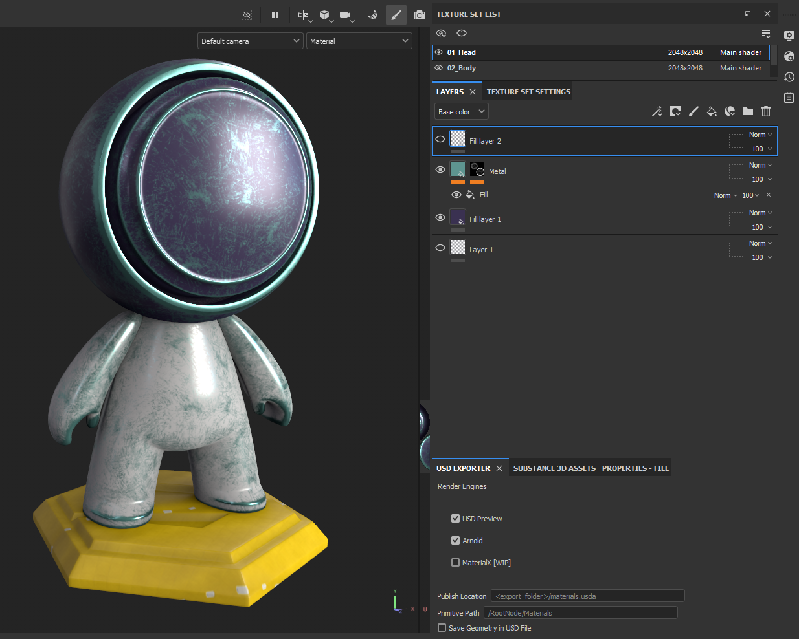
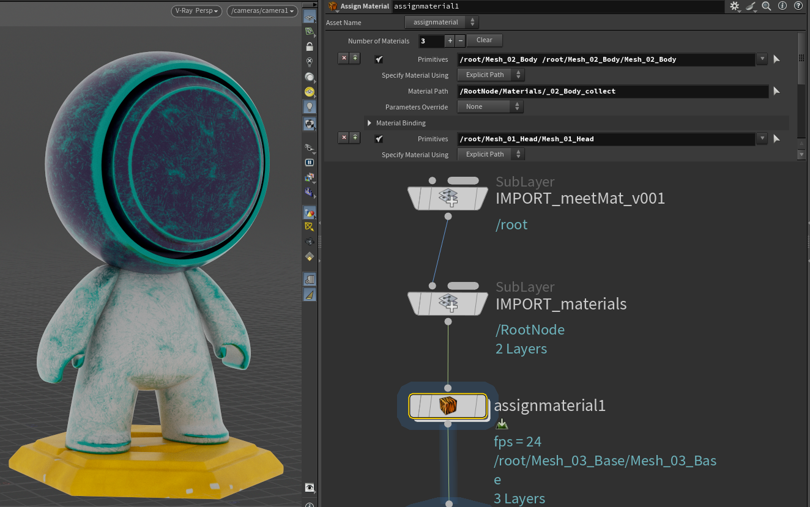

# Substance Painter USD Export Plugin
This plugin allows you to export materials and geometry from Adobe Substance Painter to USD (`.usda`) files, supporting multiple render engines (USD Preview, Arnold, MaterialX).


## Features
- Export Substance Painter materials as USD with shader networks for:
  - USD Preview Surface
  - Arnold Standard Surface
  - MaterialX (WIP)
- Export mesh geometry to USD
- Customizable export location and primitive path
- Simple UI for export settings


## Installation
1. Download the latest release zip from GitHub Releases (`AxeFX_usd_plugin.zip`).
2. Unzip it into your Substance Painter plugins directory, usually located at:
   - Windows: `C:\Users\<USERNAME>\Documents\Adobe\Adobe Substance 3D Painter\python\plugins`
   - macOS: `~/Library/Application Support/Adobe/Adobe Substance 3D Painter/python/plugins`
   - Linux: `~/.local/share/Adobe/Adobe Substance 3D Painter/python/plugins`
   This will place `AxeFX_usd_plugin.py` and `sp_usd_creator/` directly in the plugins folder.
3. Restart Substance Painter.

If you previously installed a folder named `AxeFX_usd_plugin/` or an older `sp_usd_creator/`, delete them to avoid duplicate plugins.

## Developer Install
1. Build the plugin bundle:
   - `python tools/build_plugin.py`
2. Copy `dist/AxeFX_usd_plugin.py` and `dist/sp_usd_creator/` into your Substance Painter plugins directory.
3. Optional dev install on Windows:
   - `powershell -File tools/install_plugin.ps1`

## Documentation
- User guide: `docs/USER_GUIDE.md`
- Developer guide: `docs/DEVELOPER_GUIDE.md`


## Usage
1. Start Substance Painter.
2. Click on Menu Bar -> `Plugins` -> `USD Export Plugin` to open the plugin UI.
   - If the plugin is not visible, ensure it is installed in the correct directory.
3. Configure the export settings:
   - **Render Engines**: Select the render engines you want to export (USD Preview, Arnold, MaterialX).
   - **Publish Directory**: Set the directory where USD files will be created (e.g., `<export_folder>`).
   - **Primitive Path**: Set the path for the root node in the USD file (e.g., `/RootNode/Materials`).
   - **Save Geometry**: Check this option to export mesh geometry as a separate USD file (e.g., `mesh.usd`).
4. Export the textures normally in Substance Painter. The plugin will run automatically after the export process.
5. The plugin will create a `.usda` file with the specified materials and optionally a `.usd` mesh file if geometry export is enabled.
6. The generated USD file can be opened in any compatible viewer or software that supports USD.



<br>

## Examples
### Exporting Materials and Geometry

1. Open the plugin UI and configure the following settings:
   - **Render Engines**: Enable `USD Preview` and `Arnold`.
   - **Publish Directory**: Set to `<export_folder>`.
   - **Primitive Path**: Set to `/RootNode/Materials`.
   - **Save Geometry**: Check this option to export mesh geometry.

2. Export textures in Substance Painter. The plugin will:
   - Generate a USD file with materials and shader networks.
   - Optionally export a `mesh.usd` file containing the geometry.


<br>

### Example USD Material File:
Example File provided: [main.usda](Examples/main.usda)


### Example ASCII USD Material 
The following is an example of the generated `.usda` file for a material named `_02_Body_collect` with a shader network using `UsdPreviewSurface` and texture inputs:

```usd
#usda 1.0

def "RootNode"
{
    def Scope "Materials"
    {
        def Material "_02_Body_collect"
        {
            int inputs:inputnum = 2
            token outputs:surface.connect = </RootNode/Materials/_02_Body_collect/UsdPreviewNodeGraph/UsdPreviewSurface.outputs:surface>

            def NodeGraph "UsdPreviewNodeGraph"
            {
                def Shader "UsdPreviewSurface"
                {
                    uniform token info:id = "UsdPreviewSurface"
                    float3 inputs:diffuseColor.connect = </RootNode/Materials/_02_Body_collect/UsdPreviewNodeGraph/albedoTexture.outputs:rgb>
                    float3 inputs:roughness.connect = </RootNode/Materials/_02_Body_collect/UsdPreviewNodeGraph/roughnessTexture.outputs:r>
                    token outputs:surface
                }

                def Shader "albedoTexture"
                {
                    uniform token info:id = "UsdUVTexture"
                    asset inputs:file = @F:/Users/Ahmed Hindy/Documents/Adobe/Adobe Substance 3D Painter/export/02_Body_Base_color.png@
                    float2 inputs:st.connect = </RootNode/Materials/_02_Body_collect/UsdPreviewNodeGraph/TexCoordReader.outputs:result>
                    float3 outputs:rgb
                }

                def Shader "TexCoordReader"
                {
                    uniform token info:id = "UsdPrimvarReader_float2"
                    token inputs:varname = "st"
                    float2 outputs:result
                }
                
                def Shader "roughnessTexture"
                {
                    uniform token info:id = "UsdUVTexture"
                    asset inputs:file = @F:/Users/Ahmed Hindy/Documents/Adobe/Adobe Substance 3D Painter/export/02_Body_Roughness.png@
                    float2 inputs:st.connect = </RootNode/Materials/_02_Body_collect/UsdPreviewNodeGraph/TexCoordReader.outputs:result>
                    float3 outputs:r
                }
            }
        }
    }
}

