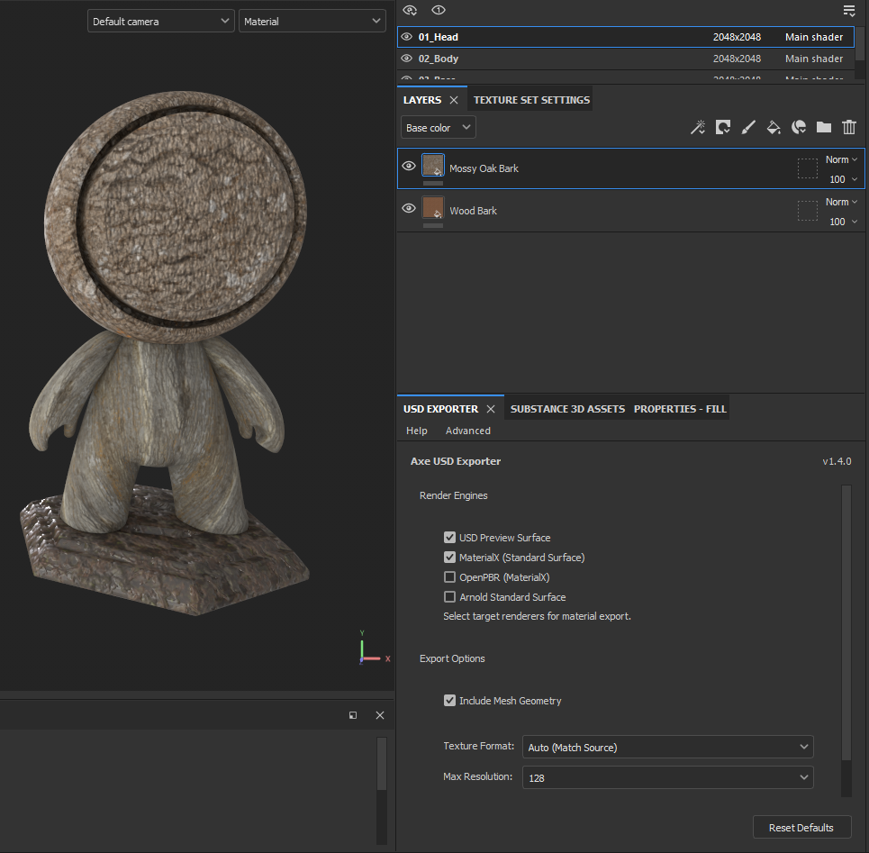
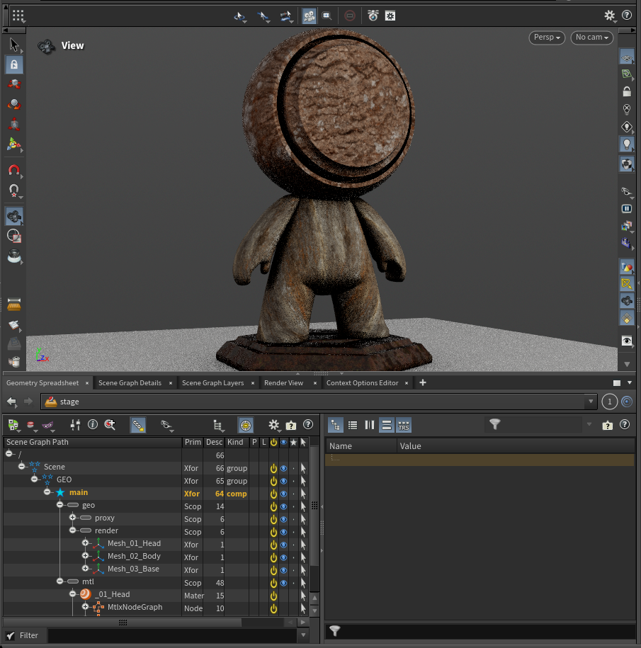
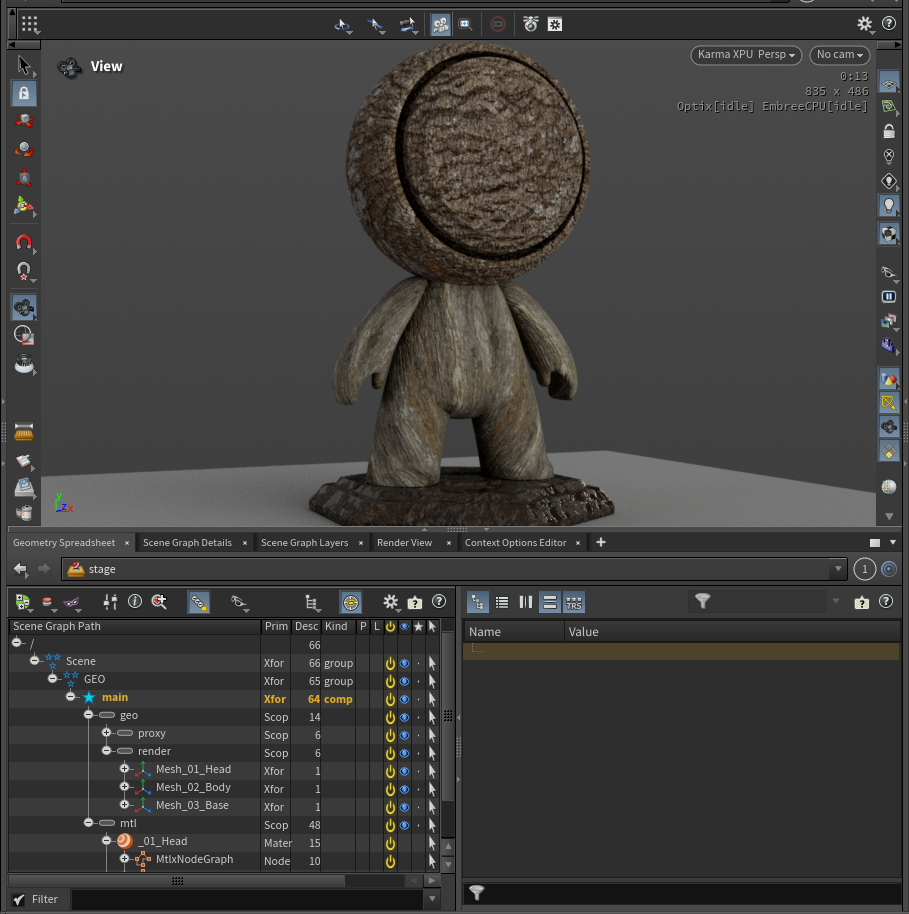
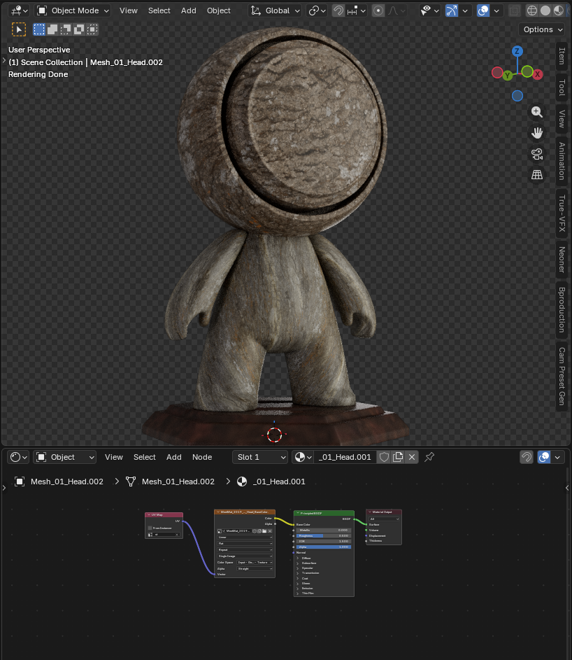

# Substance Painter USD Export Plugin

[](https://www.python.org/downloads/)
[](https://vfxplatform.com/)
[](https://opensource.org/licenses/MIT)
[](https://github.com/astral-sh/ruff)
[](docs/user_guide.rst)

Export materials and optional mesh geometry from Adobe Substance Painter to USD (`.usd`) with renderer-ready shader networks.
Supports Substance Painter 8.3.0+ and the VFX Platform CY2024 spec.

**[Full User Documentation](docs/user_guide.rst)**

## Screenshots

| | |
|:---:|:---:|
| <br>Substance Plugin UI | <br>Houdini OpenGL |
| <br>Houdini Karma XPU | <br>Blender 5.0 |

<p align="center">
    <em>The screenshots above show the plugin UI in Substance Painter and exported USD assets validated in Houdini (OpenGL and Karma XPU) and Blender 5.0.</em>
</p>

## Features

- Exports material networks for USD Preview, Arnold, MaterialX Standard Surface, and OpenPBR.
- Optionally exports mesh geometry and writes a layered USD publish (`Asset.usd`, `payload.usdc`, `mtl.usdc`, optional `geo.usdc`).
- Moves exported textures into a structured publish folder: `<export_dir>/Asset/textures/`.
- Supports optional USD Preview texture format and max resolution overrides.
- Preserves per-texture-set mesh assignment intent during material binding.

## Quick Start (End Users)

1. Download and extract the latest `axe_usd_plugin.zip` from [GitHub Releases](https://github.com/Ahmed-Hindy/Substance-Painter-Usd-Creator/releases).
2. Copy `axe_usd_plugin/` into your Substance Painter plugins directory:
   - Windows: `C:\Users\<USERNAME>\Documents\Adobe\Adobe Substance 3D Painter\python\plugins`
   - macOS: `~/Library/Application Support/Adobe/Adobe Substance 3D Painter/python/plugins`
   - Linux: `~/.local/share/Adobe/Adobe Substance 3D Painter/python/plugins`
3. Restart Substance Painter.
4. Open `Plugins -> USD Exporter` and export textures as usual.
5. Open `<export_dir>/Asset/Asset.usd` in your USD viewer.

## Output Layout

```text
<export_dir>/
`-- Asset/
    |-- Asset.usd
    |-- payload.usdc
    |-- mtl.usdc
    |-- geo.usdc          # optional when mesh export is enabled
    `-- textures/
```

## Developer Installation

Release artifacts bundle USD dependencies. For local builds, `tools/build_plugin.py` downloads required USD wheels automatically.

1. Build the plugin bundle:
   - `python tools/build_plugin.py`
2. Copy `dist/axe_usd_plugin/` into your Substance Painter plugins directory.

Windows helper (build + install in one step):
- `powershell -File tools/install_plugin.ps1`
- `powershell -File tools/install_plugin.ps1 -SkipDependencies` for faster code-only updates while SP is running.

## Troubleshooting

- Plugin not visible:
  - Confirm Substance Painter 8.3.0+.
  - Confirm `axe_usd_plugin/` is directly inside your plugins directory.
  - Restart Substance Painter after install/update.
- No USD output:
  - Confirm texture export completed successfully first.
  - Confirm export destination is writable.
- Missing metallic/height output:
  - Confirm filenames include expected tokens such as `metallic`/`metalness` and `height`/`displacement`.

## Documentation

- [User Guide](docs/user_guide.rst)
- [Developer Guide](docs/developer_guide.rst)

## Example USD File

[Asset/Asset.usd](Examples/Asset/Asset.usd)
